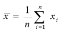
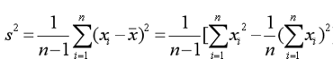
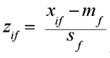
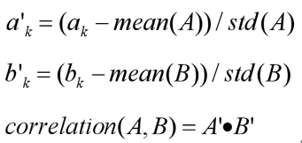

# 小组信息

- 组员信息：陈天诚（组长）、童邦凡
- 组员分工：陈天诚（数据库搭建、代码及注释编写、文档编辑），童邦凡（功能测试、注释编写、文档编辑）
- 指导老师：彭伟龙

# 作业题目和内容

## 题目

广州大学某班有同学100人，现要从两个数据源汇总学生数据。第一个数据源在Excel中，第二个数据源在txt文件中，两个数据源课程存在缺失、冗余和不一致性，请用C/C++/Java/Python程序实现对两个数据源的一致性合并以及每个学生样本的数值量化。

- Excel表：ID (int), 姓名(string), 家乡(string:限定为Beijing / Guangzhou / Shenzhen / Shanghai), 性别（string:boy/girl）、身高（float:单位是cm)）、课程1成绩（float）、课程2成绩（float）、...、课程10成绩(float)、体能测试成绩（string：bad/general/good/excellent）；其中课程1-课程5为百分制，课程6-课程10为十分制。
- txt文件：ID(string：6位学号)，性别（string:male/female）、身高（string:单位是m)）、课程1成绩（string）、课程2成绩（string）、...、课程10成绩(string)、体能测试成绩（string：差/一般/良好/优秀）；其中课程1-课程5为百分制，课程6-课程10为十分制。

## 参考

##### 一.数据源1.xlsx

| ID   | Name  | City     | Gender | Height | C1   | ...  | C10  | Constitution |
| ---- | ----- | -------- | ------ | ------ | ---- | ---- | ---- | ------------ |
| 1    | Marks | Shenzhen | boy    | 166    | 77   |      |      | general      |
| 2    | Wayne | Shenzhen | girl   | 159    | 77   |      |      | good         |
| ...  | ...   | ...      | ...    | ...    | ...  | ...  | ...  | ...          |


##### 二.数据源2-逗号间隔.txt

ID,Name,City,Gender,Height,C1,C2,C3,C4,C5,C6,C7,C8,C9,C10,Constitution
202001,Marks,Shenzhen,male,1.66,77,100,84,71,91,6,7,6,8,,general

…………

## 实验内容

##### 两个数据源合并后读入内存，并统计：

1. 学生中家乡在Beijing的所有课程的平均成绩。
2. 学生中家乡在广州，课程1在80分以上，且课程9在9分以上的男同学的数量。(备注：该处做了修正，课程10数据为空，更改为课程9)
3. 比较广州和上海两地女生的平均体能测试成绩，哪个地区的更强些？
4. 学习成绩和体能测试成绩，两者的相关性是多少？（九门课的成绩分别与体能成绩计算相关性）

## **提示**

##### 参考数据结构：

Student{

int id;

string id;

vector<float> data;

}


可能用到的公式：

| 均值公式                 |  |
| :----------------------- | :---------------------------: |
| **协方差公式**           |  |
| **z-score规范化**        |  |
| **数组A和数组B的相关性** |  |

注意：计算部分不能调用库函数；画图/可视化显示可以用可视化API或工具实现。

# 作业环境

+ Windows10

+ Anaconda Python3.8.5（IDE为pycharm）

## 文件说明

+ ##### 源代码
  
  - 「AddData.py」功能：将<一.数据源1.xlsx>表格导入到MySQL数据库
  - 「LoadSqlData.py」功能：从数据库中将数据源1读取为<一.数据源1_NEW.xlsx>
  - 「txtToExcel.py」功能：将文本<一.数据源2-逗号间隔.txt>文件转换为Excel表格的<一.数据源2_NEW.xlsx>文件
  - 「MergeList.py」功能：将之前生成的<一.数据源1_NEW.xlsx>与<一.数据源2_NEW.xlsx>合并为一张表<合并数据源.xlsx>
  - 「DealData.py」功能：处理已合成的数据，解决提出的问题
+ ##### 文件夹「resources」存放数据源文件
  
  - 「一.数据源1.xlsx」：数据源1
  - 「一.数据源2-逗号间隔.txt」：数据源2
+ ##### 文件夹「Processing_source」存放数据源的处理结果
  
  - 「一.数据源1_NEW.xlsx」：新数据源1
  - 「一.数据源2_NEW.xlsx」：新数据源2
  - 「合并数据源.xlsx」：最终合并数据结果
+ ##### 文件夹「result」存放运行结果截图
  
  + 输出合并后数据源
  + 输出学生中家乡在Beijing的所有课程的**平均成绩**
  + 输出学生中家乡在广州，课程1在80分以上，且课程9在9分以上的男同学的**数量**
  + 输出比较广州和上海两地女生的平均体能测试成绩并判断哪个地区的更强些
  + 输出学习成绩和体能测试成绩两者的**相关性**

## 函数说明

### 定义一个写excel表的方法

```python
    def write(self, data_path, sheetname, value):
        index = len(value)
        workbook = openpyxl.Workbook()
        sheet = workbook.active
        sheet.title = sheetname
        for i in range(0, index):
            for j in range(0, len(value[i])):
                sheet.cell(row=i + 1, column=j + 1, value=str(value[i][j]))
        workbook.save(data_path)
        print("xlsx格式表格写入数据成功！")

        workbook.close()
```

将写入结果保留到data_path路径当中

### 定义一个读数据库的方法

```python
    def read(self, table):
        try:
            sql = "select * from " + table
            self.cursor.execute(sql)#执行sql语句查表
            self.connect.commit()#向MySQL服务器提交当前事务
            description = self.cursor.description#获取每个字段的属性域名
            title = []

            # 取表的各表头
            for data in description:
                title.append(data[0])

            datas = [] #存表内容

            # 取表的内容
            for row in self.cursor.fetchall():#fetchall函数返回多个元组
                sheelData = {}
                for col in range(len(row)):
                    sheelData[title[col]] = row[col]
                datas.append(sheelData)
            return datas
        except Exception as e:
            print(str(e))
            print("数据读取错误")
```


### getCount筛选函数

```python
def getCount(key, value):
    """设置一个条件及关键词，返回满足该条件的关键词的列表"""
    In_City = df[df[key] == value]
    return In_City
```


### score体能成绩量化函数

```python
def score(key):
    """将体能成绩量化：excellent = 2, good = 1, general = 0, bad =-1."""
    sum = []
    for i in df[key]:
        if i == 'excellent':
            sum.append(2)
        elif i == 'good':
            sum.append(1)
        elif i == 'general':
            sum.append(0)
        elif i == 'bad':
            sum.append(-1)
        else:
            sum.append(0)
    return sum
```


### 计算平均值函数

```python
def Avg(list):
    """计算平均值 avg(a)=（a1+a2+……+an)/n"""
    sum = 0
    nan_num = 0
    for i in list:
        if math.isnan(i):
            nan_num += 1
        else:
            sum += i
    return sum / (len(list) - nan_num)
```


### 标准差函数

```python
def Cov(list):
    """计算标准差s
    协方差：s**2 = ((x1-avg(x))**2+(x2-avg(x))**2+……+(xn-avg(xn))**2)/(n-1)
    """
    result = 0
    nan_num = 0
    for i in list:
        if math.isnan(i):
            nan_num += 1
        else:
            result += (i - Avg(list)) ** 2
    return (result / (len(list)+nan_num)) ** 0.5
```


### 计算A'函数

```python
def course(row):
    """计算A‘ ：计算 a’ = (ak-mean(A))/std(A)"""
    list_a = []
    for col in df[row]:
        if math.isnan(col):
            list_a.append((80 - Avg(df[row])) / Cov(df[row]))
        else:
            list_a.append((col - Avg(df[row])) / Cov(df[row]))
    return list_a
```


### 计算B'函数

```python
def b():
    """计算B‘ ：计算 b’ = (bk-mean(B))/std(B)"""
    num = score('Constitution')
    sumb = []
    for col in num:
        sumb.append((col - Avg(num)) / Cov(num))
    return sumb

```


### 相关性函数

```python
def correlation():
    """计算相关性；correlation(A,B) = A'* B' """
    key = ['C1', 'C2', 'C3', 'C4', 'C5', 'C6', 'C7', 'C8', 'C9']
    list_b = b()

    # 用课程每一列与体能成绩做相关性计算即：n*9矩阵 与 n*1矩阵 相乘
    for i in range(len(key)):
        list_a = course(key[i])
        for e in range(len(list_a)):
            sum = 0 # 计算结果
            # 一维矩阵做相乘
            for col in range(len(list_b)):
                temp = list_a[col] * list_b[col] # 点积
                if math.isnan(list_a[col]):
                    print("发现nan")
                sum += temp
        print("\n%s 与 Constitution 的相关系数：%s" % (key[i], temp))
```


## 调用的函数库以及涉及哪些技术

### 函数库

+ ```python
  import xlrd
  ```

+ ```python
  import MySQLdb
  ```

+ ```python
  import openpyxl
  ```

+ ```python
  import pymysql
  ```

+ ```python
  from openpyxl import Workbook
  ```

- ```python
  import pandas as pd
  ```

- ```python
  import os
  ```

- ```python
  import math
  ```

### 涉及的技术

| 调用的函数                | 函数说明                                                     |
| ------------------------- | ------------------------------------------------------------ |
| open_workbook(filename)   | 打开文件，文件名若包含中文，会报错找不到这个文件或目录。<br>参数：filename文件名 |
| sheet_by_name(sheetname)  | 获取要遍历的sheet<br>参数：sheetname页名                     |
| MySQLdb.connect           | 连接Mysql数据库，返回一个数据库连接对象。<br>参数列表：<br>host，连接的数据库服务器主机名，默认为本地主机(localhost)。<br>user，连接数据库的用户名，默认为当前用户。<br>passwd，连接密码，没有默认值。<br>db，连接的数据库名，没有默认值。<br>port，指定数据库服务器的连接端口，默认是3306。 |
| cursor                    | 游标是系统为用户开设的一个数据缓冲区，存放SQL语句的执行结果  |
| cursor.execute(sql,param) | 执行数据库操作                                               |
| cursor.close              | 关闭指针对象                                                 |
| database.commit           | 事务提交                                                     |
| database.close            | 关闭数据库                                                   |
| openpyxl.Workbook         | 创建至少一个worksheet（工作表）                              |
| openpyxl.active           | active_sheet_index这个属性，默认设置的值是0，除非你指定一个值，否则总是获取到第一个worksheet。 |
| openpyxl.save             | 保存工作表                                                   |

# 难题与解决

### 1.数据缺失

在数据插入时，写入未异常故不做操作。

在数据计算时，缺失的数据给与一个人为指定的数值。

解决：因为python读到空白值时，是一个无类型的nan(Not a Number)。需用math库的 math.isnan()函数判空。

### 2.数据重复

##### 数据源1.

存入数据库时，将ID设为主键，ID重复的插入表SQL语句会插入失败，并抛出异常。

##### 数据源2.

转为Excel文件后，利用Python对Excel的库函数将重复的去除。

### 3.数据单位不统一

##### 学号(ID)编号不统一

在将数据库表中数据加载到本地时，ID号字符串转整数型与202000做加法计算，再存入Excel表中。

##### 性别(Gender)叫法不统一

两数据源：男（boy，male），女（girl，female）。

小组将性别规定为男（boy），女（girl）。

##### 身高(Height)单位不统一

因为实验题目要求身高单位为cm。

### 4.数据合并

两个数据源之间存在重复的数据，或者拥有对方缺失的数据。

##### 1）先以数据源1为主表，数据源2为副表，使用panda的处理excel的合并函数combine做合并，目的是将补	  全表1空缺内容。合并结果存放于临时表内。

##### 2）而后再将临时表与表2的合并，因为数据源2存在数据源1没有的列数据。

##### 3）因为合并结果是无序，存在重复的数据，故需要使用去重复，排序的函数进行处理。

注：两次合并皆是用外连接outer进行合并，最大程度保留数据。

### 5.体能成绩的计算

先将其成绩**量化**，我组之策略是：excellent(杰出) = 2, good(好) = 1, general(普通) = 0, bad(坏) = -1.数值化后当正常数据处理。

## Git安装及语法

转载自CSDN

### [\# Git的安装与使用教程（超详细！！！）](https://blog.csdn.net/weixin_44950987/article/details/102619708)

# 总结

数据清洗就是对数据重新审查与校验的过程，从这个过程中需要了解学习有关于一致性检查、无效值和缺失值的处理、去重等操作原理以及代码实现。就本次实验内容来说，将两张有缺失、冗余和不一致的数据源表进行一致性合并，字面上并不难理解，即将两张表的度量标准统一（如身高单位、性别表示），将一张表中缺失的数据用另一张表中的数据进行补充（如果存在的话），将两张表所有学生加在一起构成一张新的表，还要去掉重复的学生数据。

难点在于如何利用Python做到代码实现。因为对Python还未达到“精通”的地步，所以需要一边构思一边学习库文档，需要花费多半时间百度库函数的使用，虽然过程很艰苦，但只要将正确合并的表格成功导出之后，最难的一部分就已经啃下来了，最后看到代码在机器上跑起来将数据分析做出解答，还是感觉很有成就感，中间也学习到新的Python语法或者库函数功能，提升了自身编写代码的能力，也是收获满满。

最后就是Git/GitHub的使用，深刻体会到一个项目的诞生，离不开团队的合作。每个人都会有自己的idea，也可以将其实现，碰撞融合，交汇摩擦产生“1+1>2”的效果，一个项目也是这样，一点一滴慢慢变得强壮。

